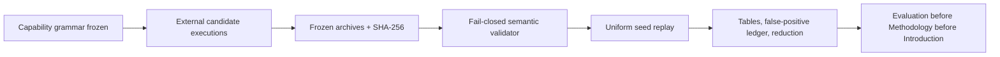
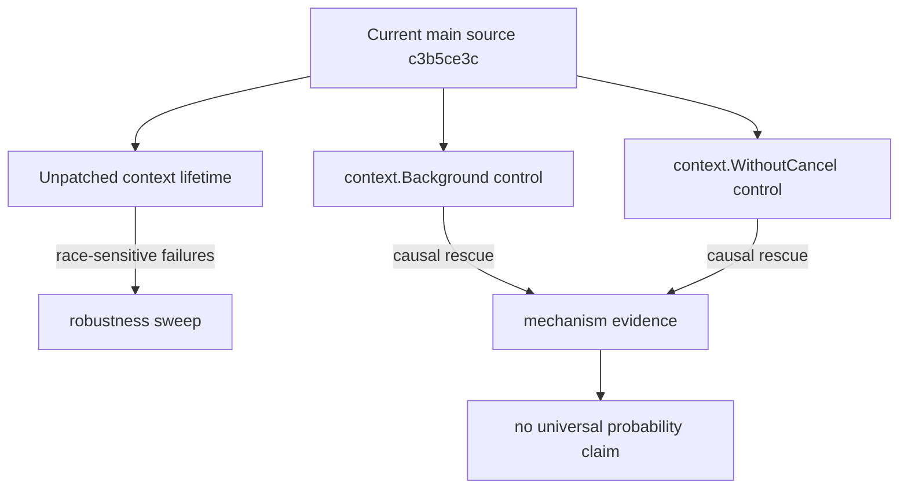

# Final Paper Figures and Plot Data

The figures below are intentionally reproducible from committed JSON rather than hand-edited screenshots.

## Figure 1 — Evidence pipeline

## Figure 2 — Fair-search budget curves

| Backend/version | Candidates | Relevant class | Generic @ budget 1 | Guided @ budget 1 | Full budget |
|---|---:|---:|---:|---:|---:|
| MatrixOne v2 | 10 | 3 identity | 0.3000 | 0.6667 | 1.0000 / 1.0000 |
| Dolt 2.2.3 expanded | 10 | 6 sequence | 0.6000 | 1.0000 | 1.0000 / 1.0000 |
| Dolt 2.3.0 expanded | 10 | 6 sequence | 1.0000 | 1.0000 | 1.0000 / 1.0000 |
| SlateDB 0.14.1 expanded | 8 | 3 dependency | 0.3750 | 1.0000 | 1.0000 / 1.0000 |
| SlateDB fixed | 8 | 3 dependency | 0.0000 | 0.0000 | 0.0000 / 0.0000 |

Rates are generic / relation-guided. Dolt 2.3.0 is shown because its controls expose the false-positive/model conflict; it is not treated as a clean fair-positive result.

## Figure 3 — Dolt causal interpretation

## Figure 4 — Unseeded outcome composition

The committed `external-unseeded-replay.json` contains 160 runs (5 frozen external versions × 32 seeds), budget 4, with counts: no-failure 37, known-failure 3, duplicate-root-cause 94, false-positive 26, new-root-cause 0, oracle-ambiguity 0, harness/environment 0. The replay flag is explicit because these are uniform permutations over complete frozen candidate observations, not 160 fresh backend reruns.
